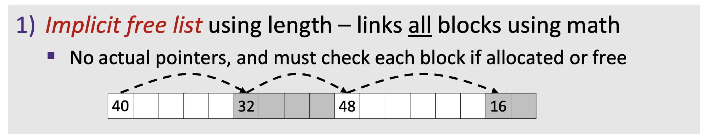

# Implementing a Simple Memory Allocator

## Overview

This is the code to implement a simple memory allocator. We implement our `void *mm_malloc(size_t size)` and `void mm_free(void *ptr)`  functions using implicit free list. 



Format of allocated and free blocks:


When we need to find a free block, we choose first fit policy. 

<p align=center> <strong>Search list from beginning, choose first free block that fits.</strong> </p>

## Dependencies

- Gcc / Clang
- Make
- Your favorite editor (Optional)

## Usage

1. Type `cd src` in terminal
2. Type `make` in terminal
3. Type `./main` in terminal

## Result

```c
malloc size: 400, heap_size: 4112
Heap (0x1058f5008):
0x1058f5008: header: [8:a] footer: [8:a]
0x1058f5010: header: [8:a] footer: [8:a]
0x1058f5018: header: [8:f] footer: [8:f]
0x1058f5020: header: [8:a] footer: [8:a]
0x1058f5028: header: [8:a] footer: [8:a]
0x1058f5030: header: [8:a] footer: [8:a]
0x1058f5038: header: [24:a] footer: [24:a]
0x1058f5050: header: [24:f] footer: [24:f]
0x1058f5068: header: [24:a] footer: [24:a]
0x1058f5080: header: [24:a] footer: [24:a]
0x1058f5098: header: [24:a] footer: [24:a]
0x1058f50b0: header: [32:a] footer: [32:a]
0x1058f50d0: header: [32:f] footer: [32:f]
0x1058f50f0: header: [32:a] footer: [32:a]
0x1058f5110: header: [32:a] footer: [32:a]
0x1058f5130: header: [32:a] footer: [32:a]
0x1058f5150: header: [40:a] footer: [40:a]
0x1058f5178: header: [40:f] footer: [40:f]
0x1058f51a0: header: [40:a] footer: [40:a]
0x1058f51c8: header: [40:a] footer: [40:a]
0x1058f51f0: header: [40:a] footer: [40:a]
0x1058f5218: header: [48:a] footer: [48:a]
0x1058f5248: header: [48:f] footer: [48:f]
0x1058f5278: header: [48:a] footer: [48:a]
0x1058f52a8: header: [48:a] footer: [48:a]
0x1058f52d8: header: [48:a] footer: [48:a]
0x1058f5308: header: [3336:f] footer: [3336:f]
0x1058f6010: EOL
```


## Contributors

Most of the code are based on instructions from [CS:APP3e](http://www.csapp.cs.cmu.edu/) and I finished this repo in 3 hours. 

## Reference

- Textbook: [CS:APP3e](http://www.csapp.cs.cmu.edu/) 
- Github repository: [DreamAndDead/CSAPP-3e-Solutions](https://github.com/DreamAndDead/CSAPP-3e-Solutions/) 
- UW CSE351 Slides: [Memory Allocation](https://courses.cs.washington.edu/courses/cse351/19sp/lectures/24/CSE351-L24-memalloc-I_19sp.pdf)